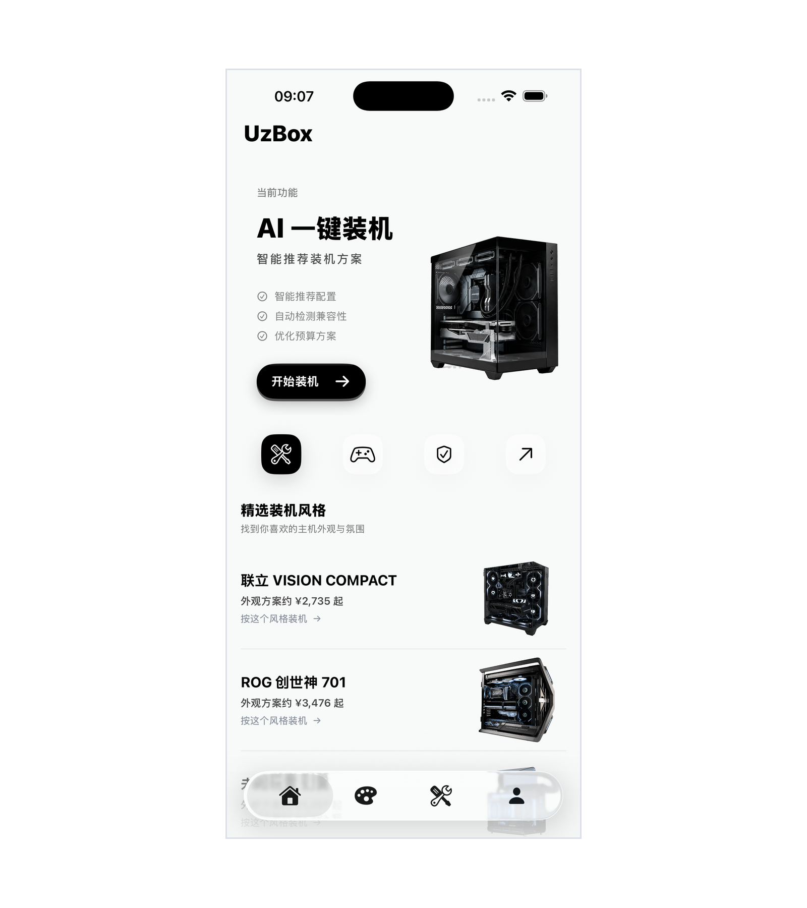
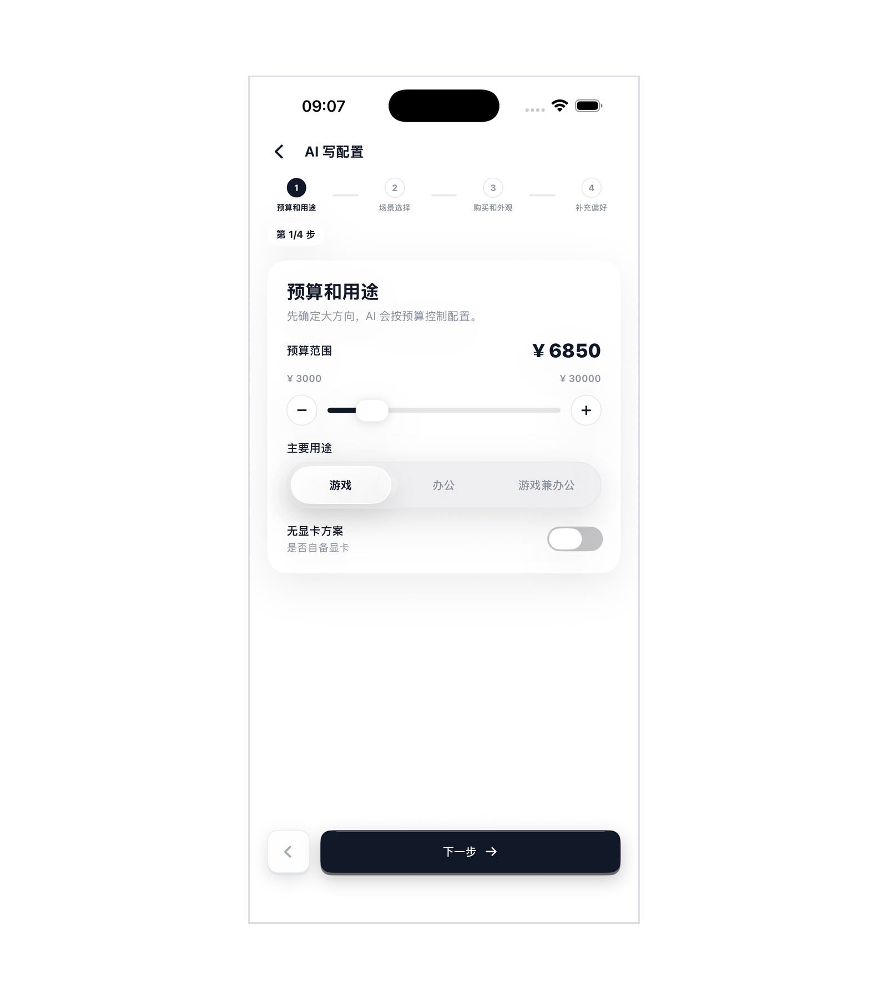
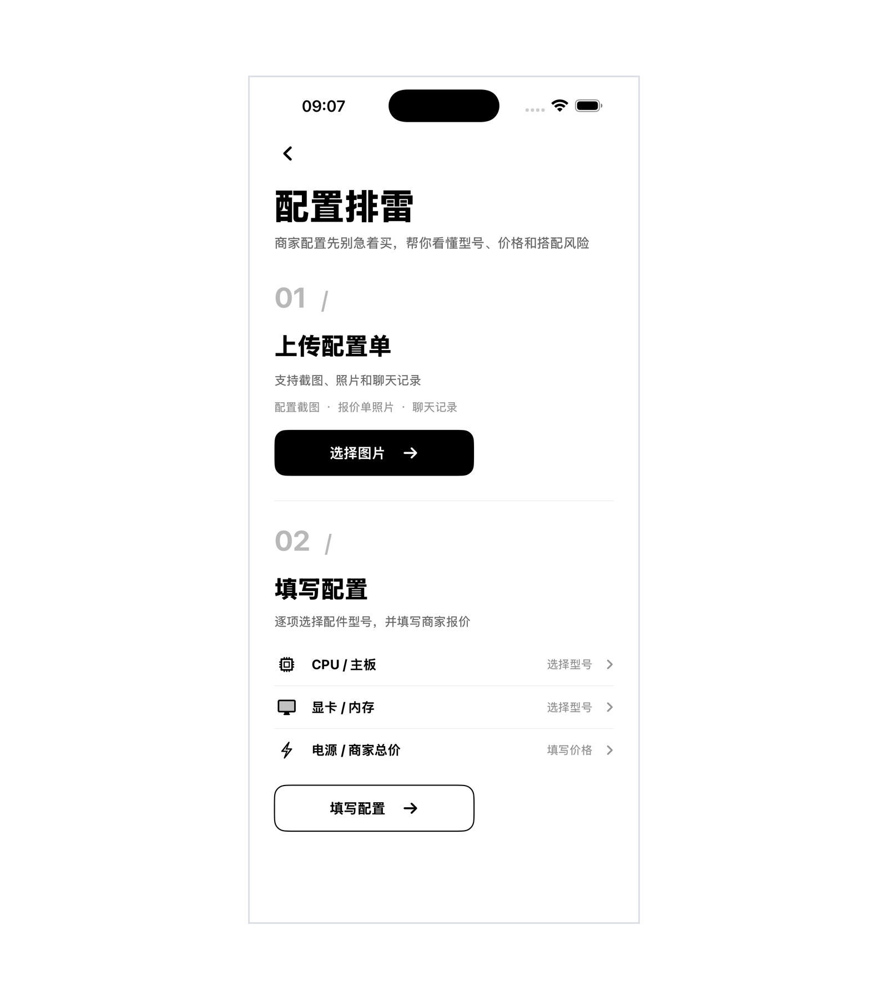
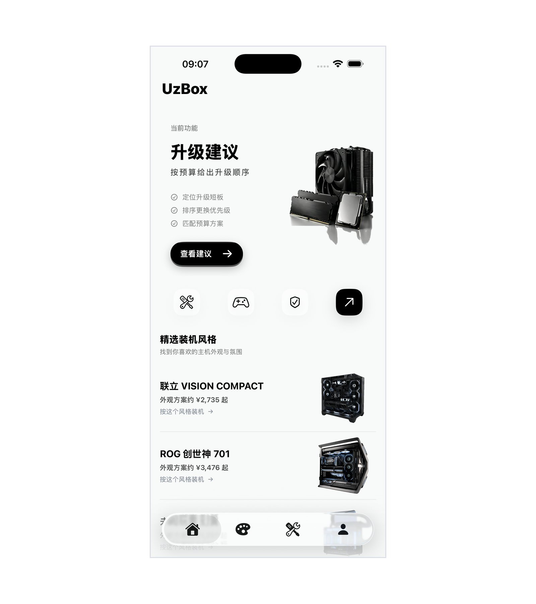
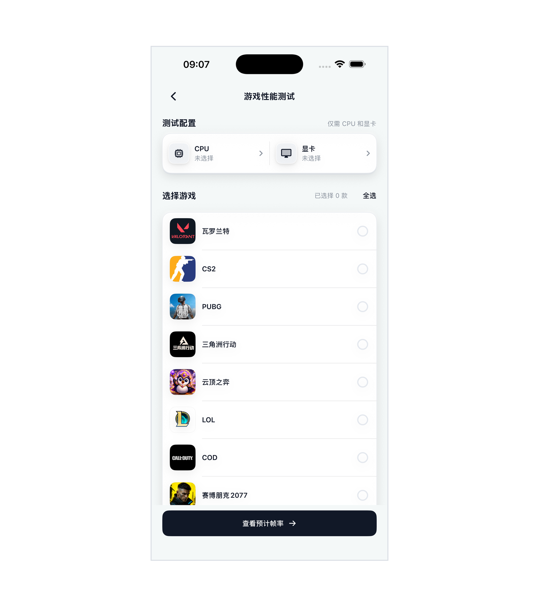

# UzBox ai装机助手 V1.0 操作手册

## 一、相关文档

| 文档名称 | 指向资料 | 说明 |
| --- | --- | --- |
| 总体设计 | 《总体设计》 | 说明软件整体功能、页面组成、运行环境和业务边界。 |
| 详细设计 | 《详细设计》 | 说明各功能页面、输入输出、状态变化和处理规则。 |
| 测试案例 | 《测试案例》 | 记录主要功能的操作场景、预期结果和异常提示。 |

## 二、说明

UzBox ai装机助手 V1.0 是一款面向个人电脑装机、配置检查和性能评估场景的 Android 应用软件。客户端提供启动与协议确认、AI 一键装机、配置排雷、升级建议、游戏性能测试、DIY 配置、风格浏览和个人页面，适合希望按预算选购电脑、核对商家配置单或了解升级方向的普通用户。

装机价格、硬件库存和游戏表现会随地区、时间、驱动与测试条件变化。本软件显示的价格、总价、功耗和帧率均为参考信息，不能替代下单前的实时询价、实物兼容性检查或实际性能测试。

装机、硬件目录、配置排雷、性能估算和升级建议页面会使用共享服务。取得服务响应时，页面展示返回结果；未取得响应时，相关页面会按各自逻辑展示内置参考内容，不一定另外弹出统一提示。该共享服务也供项目现有 iOS 客户端使用，本手册只说明本次登记的 Android 客户端操作。

当前版本保留了若干用于演示操作流程的页面和按钮。启动页的“本机号码一键登录”只完成页面切换；配置、升级和 DIY 页的保存按钮只显示操作提示；配置排雷页的复制按钮不会写入系统剪贴板；反馈表单不会实际提交；注销页也明确提示演示版不会真正注销账号。

## 三、功能特点

应用启动后先显示 UzBox 品牌画面，再进入协议确认页面。用户必须勾选用户协议和隐私政策才能继续；按钮短暂显示“正在登录”后进入首页，此过程不执行真实运营商认证。

首页集中放置 AI 一键装机、游戏性能测试、配置排雷和升级建议四项任务，并通过底部导航连接首页、风格、DIY 和我的页面。用户可以从首屏直接选择当前要处理的事项。

AI 一键装机分四步展示预算、用途、游戏、无线网络、装机方向、主机颜色、升级取向、内存和存储等选项。页面已有默认选择，可直接逐步继续。提交后优先展示共享服务返回的候选方案；未取得响应时显示内置参考方案。

配置排雷支持选择六类配件的型号并填写单项价格，也可以选择配置单图片。结果页展示检查结论、风险项和商家沟通文字。手动填写至少完成两项配件的型号与价格后才能开始检查。

升级建议页面使用内置示例硬件发起当前版本的升级请求，用户可调整升级目标、预算、分辨率、目标帧率和参考游戏。游戏性能测试允许选择 CPU、GPU 和游戏，结果页显示 Time Spy 参考分数、性能级别和预计平均帧率。

DIY 页面可以从共享目录或内置候选中选择配件，并更新已选数量、参考总价和估算功耗。风格页提供当前客户端内置的机箱图片和方案信息。我的页面展示静态配置示例、临时电脑档案、协议、联系邮箱和账号操作说明。

## 四、系统要求

| 系统要求 | 最低配置 | 推荐配置 |
| --- | --- | --- |
| Android 客户端 | Android API 24 及以上；安装发布版应用即可 | Android 10 及以上，建议 4GB 以上内存 |
| 客户端安装 | 终端用户无需安装 Flutter 或 Dart SDK | 使用正式签名的 Android 发布版 |
| 共享服务端 | Linux、Python 3.9 及以上、Uvicorn | Linux、Python 3.9 及以上、PostgreSQL；按部署需要启用 Redis |
| 网络 | 能够访问配置服务地址 | 稳定的 HTTPS 网络，服务地址以发布环境配置为准 |

Android 终端用户只需安装发布版应用。Flutter、Dart 和开发工具属于开发环境，不是手机端运行软件的前置条件。网络不可用时，部分页面仍会打开并显示内置参考内容，但这些内容不代表实时服务结果。

## 五、启动与进入首页

打开应用后，屏幕先显示 UzBox 品牌启动画面。启动画面结束后，页面自动切换到协议确认与进入页面，页面中可以看到“本机号码一键登录”按钮、用户协议和隐私政策勾选项。

未勾选协议时点击按钮，页面会弹出“请先阅读并同意”的提醒。阅读相关说明并勾选同意项后再次点击按钮，按钮短暂显示“正在登录”，随后进入首页。当前版本没有接入真实运营商号码认证，因此该操作只代表用户同意协议并进入主页面。



## 六、首页与底部导航

首页首屏显示 UzBox 品牌标题以及 AI 一键装机、游戏性能测试、配置排雷和升级建议四张任务卡片。每张卡片都有对应的开始按钮，点击后进入该任务的第一页。首屏下方还展示精选装机风格，点击方案行可以进入对应详情。

底部导航包含首页、风格、DIY 和我的四项。点击其中一项后，当前项显示为选中状态，页面切换到对应内容。需要联网的任务在服务不可用或等待超时时，可能继续展示内置参考页面，用户应把结果作为界面和方案参考，并在网络恢复后重新操作。


## 七、AI一键装机需求填写

从首页点击“开始装机”后进入四步需求页面。第一步“预算和用途”可在 3000 元至 30000 元之间拖动滑块，也可以使用加减按钮按 500 元调整；主要用途可选游戏、办公或游戏兼办公，页面另有“是否自备显卡”开关。第二步显示游戏图片列表，支持多选，也允许不主动选择。

第三步页面提供无线网络开关、性能优先/颜值优先/均衡搭配三种装机方向，以及曜石黑、纯净白两种主机颜色。第四步用于选择当前体验优先或保留升级空间，并设置内存与存储；预算位于部分区间时，页面会把容量选项合并为“32GB 内存”与“1TB 固态”二选一。

每一步都已有默认值，当前页面没有额外的必填拦截。点击“下一步”可以按顺序前进，最后点击“生成配置方案”进入生成进度页。当前返回方案主要依据预算、用途、已选游戏、装机方向、无线网络、内存和存储；自备显卡、主机颜色和后期升级选项是否被采用，应以方案卡片实际显示为准。

生成页等待共享服务返回结果。取得响应时显示服务端候选方案，未取得响应时仍会进入内置参考方案页，不会停留在错误页面。



## 八、配置方案选择与查看

生成进度结束后，页面以卡片形式展示配置方案。每张卡片显示方案名称、采购方式标签、CPU 与显卡摘要和参考总价；采购方式只出现在结果卡片中，前一页没有这个选择项。

用户可以逐张查看卡片，对比 CPU、显卡和参考总价。点击任一方案卡片后进入“配置方案详情”页，页面依次显示参考游戏表现、完整配件清单和总计；当前列表没有独立的选择按钮、选中状态或确认动作。若共享服务没有返回可用数据，页面使用内置参考方案保持流程可查看。无论结果来源如何，页面中的型号与价格都不等同于实时库存和成交价，购买前应重新核对成色、保修、供货情况和整机兼容性。

【截图预留：生成进度页、配置方案列表和配置方案详情页。】

## 九、配置排雷与报告查看

从首页进入配置排雷后，可以选择手动填写或图片分析。手动填写页列出 CPU、主板、显卡、内存、硬盘和电源六项。每一项先选择型号，再填写商家给出的单项价格；页面底部同步显示已完成项数和当前价格合计。至少完成两项型号与价格后，检查按钮才可继续。

图片方式用于从手机相册选择配置单截图、报价单照片或聊天记录图片。选择后页面显示读取、兼容性和建议等检查进度；无法取得清晰图片时可以返回并改用手动填写。取得共享服务结果时，报告页展示相应结论；未取得结果时，页面会展示内置参考报告。结果中的风险项和价格判断只用于辅助复核，仍需结合实物型号、库存和保修确认。

报告底部显示商家沟通文字和“复制给商家”按钮。点击该按钮会出现“已复制给商家的回复”提示，但当前版本没有执行系统剪贴板写入，用户需要自行选取或记录文字。



## 十、升级建议

从首页点击“查看建议”进入升级流程。第一页列出 CPU、显卡、主板、内存、硬盘和电源六项当前部件，所有部件在当前版本中都显示“不知道”，点击部件行不会打开编辑器。该页只用于展示流程，升级请求实际采用页面内置的示例硬件，电脑档案中选择的部件不会传入此请求。

下一步可选择“帮我找短板”或“提升游戏性能”，并设置预算、分辨率、目标帧率和参考游戏。点击生成后，取得服务响应时显示更换步骤、参考价格和预计游戏帧率；服务不可用时显示内置参考结果。用户应把这些内容视为示例硬件条件下的升级参考，而不是对本人电脑的精确诊断。

结果页的“保存升级方案”按钮只显示“升级方案已保存”的操作提示，不会把方案写入本地文件、账号或远程存储。



## 十一、游戏性能测试

从首页进入游戏性能测试后，页面提供游戏列表、CPU 选择项和 GPU 选择项。用户可以选择一个或多个游戏，再点击“查看预计帧率”。如果没有主动选择，页面会使用默认 CPU、GPU 和前三个游戏继续计算。

共享服务请求固定按 2K 条件估算。结果页显示 Time Spy 显卡参考分数、性能级别以及每个游戏的预计平均帧率，并提供 1080P、2K、4K 三档切换。2K 档优先采用服务返回的平均帧率，1080P、4K 以及未取得服务响应的情况使用客户端内置参考值。

结果页只展示 Time Spy、性能级别和预计平均帧率。页面底部会说明估算条件；游戏版本、驱动、散热和后台程序都可能使实际帧率与参考值不同。



## 十二、DIY配置与硬件选择

点击底部“DIY”进入 DIY 首页，再点击开始按钮打开配件选择页。页面按 CPU、主板、显卡、内存、硬盘、电源、散热器和机箱列出槽位。点击槽位后，选择器会尝试读取共享硬件目录和参考价格；无法取得远程目录时，页面显示内置“推荐型号”候选。

选择某个型号后，槽位显示该型号，页面同步更新已选数量、参考总价和简单估算功耗。候选名称、价格和功耗均为维护数据或内置参考值，页面不会完成实体装机兼容性的最终确认。

“保存到我的配置单”按钮当前只显示操作提示，不会把组合持久化到“我的配置”列表或远程账号。

【截图预留：DIY首页、配件选择器和组合结果页。】

## 十三、风格方案浏览

点击底部“风格”，可以浏览当前客户端内置的风格卡片、机箱图片、方案名称和参考金额；首页的精选装机风格也可进入相同的详情页面。点击感兴趣的方案后，详情页显示配件概览和外观费用。

部分方案可以切换黑色或白色外观。只有客户端已有对应图片资源时，切换才会改变显示。风格图片、配件概览和金额用于比较外观方向，不代表实时在售整机或成交价格。

【截图预留：风格列表和风格详情页。】

## 十四、我的方案、电脑档案与账户帮助

点击底部“我的”可以看到电脑档案摘要、配置入口、协议与帮助入口。配置页面中的三份方案是静态示例，用于展示卡片和页面结构，不是用户此前真实保存的历史记录。

电脑档案页允许为 CPU、显卡、主板、内存、硬盘和电源选择型号，并显示“已填写几项”的完成度。选择器会优先读取共享目录，读取失败时使用内置候选。所选内容只保存在当前页面内存中，离开或重启应用后不保证保留，也不会自动传入升级建议请求。

用户可以查看用户协议、隐私政策和第三方信息共享清单。联系与投诉页显示问题类型、问题描述、联系方式、提交按钮和联系邮箱；当前问题类型选择和提交按钮没有实际处理动作，如需联系可使用页面显示的邮箱。

注销页要求输入大写“DELETE”后才启用红色按钮。点击后页面明确提示“演示版不会真正注销账号”，不会删除账号或数据。

【截图预留：我的页面、电脑档案、方案列表和帮助页面。】

## 十五、典型使用流程

用户首次打开应用时，先等待品牌启动页结束，阅读并勾选用户协议与隐私政策，然后进入首页。需要装机方案时，依次设置预算、用途、游戏、装机方向、无线网络、内存和存储，查看服务端候选方案或内置参考方案。拿到商家配置单时，可以选择至少两项配件型号并填写单项价格，也可以选择配置单图片，再阅读排雷报告与商家沟通文字。

需要了解升级方向时，用户在升级页设置目标、预算、分辨率、目标帧率和参考游戏，并注意当前结果基于内置示例硬件。需要估算游戏表现时，用户选择 CPU、GPU 和游戏，在结果页查看 Time Spy 与平均 FPS。DIY、风格和我的页面可用于浏览候选配件、外观方案、临时电脑档案和帮助信息。

## 十六、常见问题解答

问题：为什么配置结果中的价格和购买页面不完全相同？
解决方法：页面使用维护的参考价格，实际购买还会受到地区、库存、成色、保修和促销影响，下单前应重新核对。

问题：手动配置排雷为什么不能开始？
解决方法：至少为两项配件同时选择型号并填写大于零的单项价格，底部完成项数达到两项后再继续。

问题：升级页里的当前部件为什么都是“不知道”？
解决方法：当前部件行在本版本中只用于展示，升级请求采用内置示例硬件。结果只能作为流程和方案参考。

问题：性能测试结果能否当作保证值？
解决方法：不能。结果来自维护数据或内置参考值，驱动、散热、后台程序、游戏版本和实际场景都会造成差异。

问题：网络不可用时为什么仍然出现结果？
解决方法：部分业务页在请求失败或超时后会显示内置参考内容，以保证页面流程可查看；这类内容不是实时服务结果。

问题：为什么保存、复制、反馈或注销后没有实际数据变化？
解决方法：这些按钮在当前版本中只展示操作流程或提示，不执行持久化、剪贴板写入、反馈提交或真实账号注销。

## 十七、术语表

| 术语 | 解释 |
| --- | --- |
| 配置方案 | 根据预算、用途和硬件条件整理的一组电脑配件组合及其说明。 |
| 配置排雷 | 对配置单中的兼容性、性能搭配、供电和价格风险进行参考检查。 |
| 电脑档案 | 当前页面中选择的电脑主要部件信息；本版本不保证跨会话保存。 |
| 参考价格 | 软件维护或内置的比较用价格，不等同于实时成交价。 |
| 预计平均帧率 | 性能结果页根据维护数据或内置参考值展示的平均 FPS 估算。 |
| 共享服务 | 为 Android 客户端提供装机、目录、排雷、性能和升级数据的 FastAPI 服务；项目现有 iOS 客户端也使用同一服务。 |

```text
STOP_FOR_USER
NEXT_ACTION: 请一次性确认完整操作手册草稿是否符合真实业务；必要时先统一修改段落内容，再运行 confirm_stage.py --stage markdown。
```
